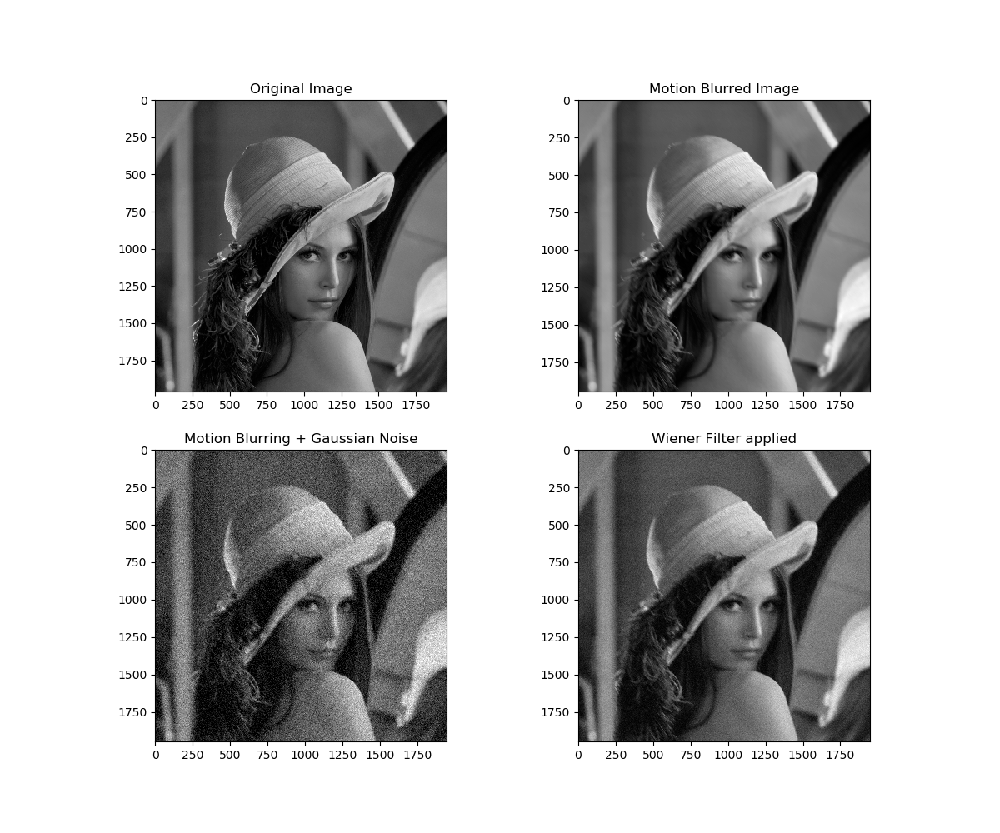

# Wiener-Filter
Wiener Filter is used to denoise and deblur noisy images corrupted by Gaussian noise and motion blurring. The implemented filter was tested on the Lena image with the resolutions of 1960x1960 and 512x512 attached in the repo.

Tran Le Anh, 
April 22, 2019
